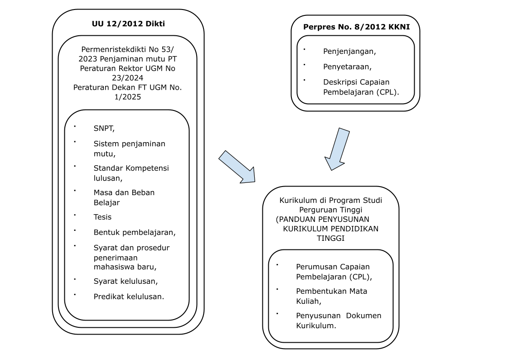
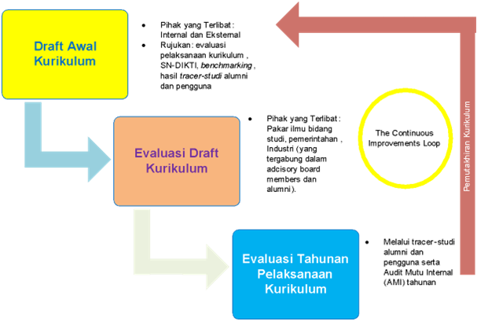

## Latar Belakang

Kurikulum Program Magister Program Studi Teknologi Informasi (PMPSTI) 2022 Versi Revisi-2 merupakan pembaharuan kurikulum PMPSTI 2022 Versi Revisi-1 dengan mempertimbangkan perubahan peraturan Menteri dari Peraturan Menteri Pendidikan dan Kebudayaan No 53 tahun 2023 dan Peraturan Rektor No 23 tahun 2024 ke Peraturan Menteri Pendidikan Tinggi, Sains, dan Teknologi Republik Indonesia No. 39 Tahun 2025 tentang Penjaminan Mutu Pendidikan Tinggi. Sedangkan kurikulum sebelumnya, yaitu Kurikulum 2022 disusun sebagai tanggapan atas berbagai perubahan yang terjadi secara multidimensi baik pada sisi aturan, visi saintifik, serta berkembangnya kebutuhan pemangku kepentingan. Kerangka formal perubahan serta manifestasi realisasi kurikulum akan sangat kental berpegangan pada aspek aturan formal baik di tingkat nasional maupun di tingkat universitas. Sementara perubahan kondisi keilmuan hingga perubahan kebutuhan pemangku kepentingan akan menjadi landasan abstraktif yang memberikan panduan pada unsur realisasi struktural kurikulum.

Perlu disadari bahwa pendidikan adalah sebuah proses fisik yang memerlukan berbagai sumber daya nyata namun dilandasi oleh semangat yang bersifat sangat abstrak. Meskipun tidak nyata, namun semangat memberikan tuntunan yang hampir tanpa batas pada sisi keluasan dan kedalaman proses pendidikan. Untuk itu, aspek aturan akan menjadi panduan yang penting karena bersifat membatasi unsur maya dan menuntun pada realisasi kurikulum dengan memberikan kerangka yang dapat diisi secara konstruktif. Untuk itu, di awal penulisan kurikulum ini, beberapa aturan yang menjadi panduan utama penulisan kurikulum ini akan dijelaskan secara singkat. 

Peta aturan yang menjadi rujukan perubahan kurikulum disajikan pada @fig-peta_rujukan Pendidikan magister adalah bagian dari proses pendidikan tinggi yang berlandaskan pada Undang-undang Republik Indonesia Nomor 12 Tahun 2012 tentang Pendidikan Tinggi. Posisi lulusan yang merupakan luaran pendidikan pascasarjana tingkat magister ini dipetakan posisinya dalam skup nasional dalam Peraturan Presiden Republik Indonesia Nomor 8 Tahun 2012 tentang Kerangka Kualifikasi Nasional Indonesia. Peraturan ini memandu dengan jelas arah pendidikan magister dengan menempatkannya pada level 8, dan memberikan deskripsi atas jenjang kualifikasinya.

Selain itu, dengan diterbitkannya Peraturan Menteri Pendidikan Tinggi, Sains, dan Teknologi Republik Indonesia No. 39 Tahun 2025 tentang Penjaminan Mutu Pendidikan Tinggi, Kurikulum Program Magister Program Studi Teknologi Informasi (PMPSTI) 2022 Versi Revisi-2 merupakan pembaharuan kurikulum PMPSTI 2022 Versi Revisi-1 dengan mempertimbangkan Peraturan Menteri Pendidikan Tinggi, Sains, dan Teknologi Republik Indonesia No. 39 Tahun 2025 tentang Penjaminan Mutu Pendidikan Tinggi dan Peraturan Rektor No 23 tahun 2024 mengakomodir perubahan jumlah SKS dari 54 SKS menjadi 36 SKS, bentuk Tesis yang dapat berupa tesis, prototipe, atau proyek, serta syarat lulus program pascasarjana. Lebih lanjut,  Peraturan Rektor UGM No. 23 Tahun 2024 menetapkan pedoman terkait proses pembelajaran, termasuk panduan isi kurikulum, persyaratan kelulusan, dan kewajiban minimal publikasi. Peraturan Dekan Fakultas Teknik UGM No. 1 Tahun 2025 tentang Pendidikan Program Pascasarjana memberikan ketentuan tambahan yang mengatur secara spesifik pelaksanaan pendidikan di tingkat pascasarjana di lingkungan Fakultas Teknik UGM.

{#fig-peta_rujukan fig-align="center"}

Realisasi dari KKNI pada tataran proses pendidikan memerlukan perumusan berbagai standar minimal yang harus terpenuhi sebagaimana diamanatkan oleh UU No. 12 tahun 2012 tentang Perguruan Tinggi pada Pasal 52 ayat 3. Standar ini tertuang dalam Standar Nasional Pendidikan Tinggi (SNPT) yang tertuang pada Permen Diktisaintek No. 39 Tahun 2025. Peraturan ini menggantikan SNPT sebelumnya. SNPT yang baru memberikan tekanan pada proses merdeka belajar dengan struktur yang tetap mirip dengan SNPT sebelumnya. Relasi berbagai aturan tersebut dapat dirangkum menjadi diagram seperti ditunjukkan pada @fig-peta_rujukan Peraturan-peraturan baru ini memerlukan penyesuaian pada kurikulum sebelumnya.

Selain aturan, perubahan kurikulum juga dipicu oleh perkembangan ilmu pengetahuan dan teknologi bidang Teknologi Informasi dan komunikasi (TIK), pemenuhan atas hasil tracer study, kebutuhan pengguna, serta dengan mempertimbangkan keberlanjutan program, yaitu sarjana, magister, dan doktor di Departemen Teknik Elektro dan Teknologi Informasi, Fakultas Teknik, Universitas Gadjah Mada. Karakter perkembangan ilmu teknologi informasi antara lain, dari  sisi ranah aplikasi, ilmu teknologi informasi telah diterapkan secara luas hampir di semua bidang kebutuhan masyarakat, mulai dari komunikasi, transportasi, healthcare, perbankan, sosial, industri, pemerintahan dan keamanan. Penyatuan teknologi informasi dengan berbagai bidang ilmu lain telah melahirkan visi-visi baru yang cenderung melahirkan tatanan baru menggantikan tatanan lama (era disrupsi). Dunia barat, diwakili Jerman, cenderung mewadahinya dalam skema industri generasi 4 (i4.0). Sementara dunia timur, diwakili Jepang, menawarkan sudut pandang masyarakat generasi 5.0 (S5.0). Kedua tatanan ini adalah gabungan dari kesatuan energi-isyarat-informasi yang berinteraksi erat dengan berbagai bidang ilmu lain dalam kerangka tatanan sosial baru. Pandemi COVID19 turut membawa unsur pemaksa perubahan zaman. Perilaku manusia dan tatanan kehidupan sudah cukup tertantang dengan visi I4.0 dan S5.0 dan lebih ditantang lagi dengan pandemi. Perubahan zaman ini perlu disikapi dengan bijak pada struktur kurikulum baru ini.

Terdapat beberapa tahap yang dilakukan dalam pembaharuan kurikulum PMPSTI UGM, yang meliputi proses penyusunan draf kurikulum, evaluasi draf kurikulum sampai proses pemutakhiran kurikulum, seperti yang diperlihatkan pada @fig-tahap_penyusunan . Setelah draft kurikulum disusun kemudian dibahas dengan pihak internal maupun eksternal. Pihak eksternal meliputi pakar ilmu bidang studi, pemerintahan, dan industry yang tergabung di dalam dewan penasihat (advisory board) dan alumni. Tugas dari dewan penasihat di dalam pembahasan draft kurikulum adalah untuk membantu perumusan Profil Profesional Mandiri/Program Educational Objective bagi PMPSTI. Sedangkan alumni memiliki peran melalui tracer study sebagai rujukan bagi evaluasi kurikulum.

{#fig-tahap_penyusunan fig-align="center"}