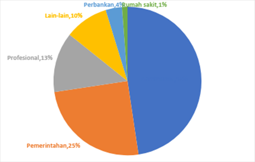
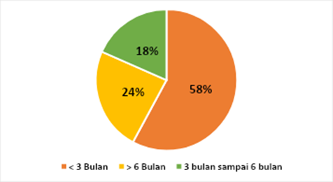
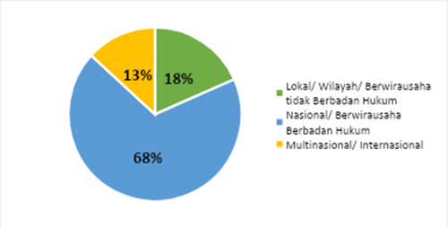
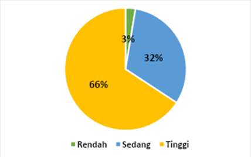
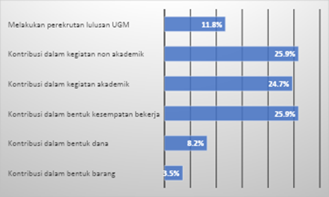
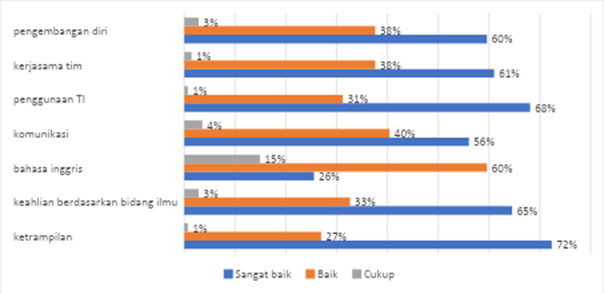

## Tracer Study dan Stakeholder Input

Dalam tahap pemutakhiran kurikulum, hasil  study dengan responden alumni dan pengguna alumni merupakan rujukan yang penting. Hasil tracer study dapat memberikan evaluasi atas ketercapaian outcome pendidikan setelah 1-5 tahun pasca kelulusan. Departemen melalui tim tracer study melakukan survei terhadap alumni PMPSTI angkatan 2016 dan 2017 yang sudah melalui proses pendidikan di PMPSTI dengan sebagian besar atau keseluruhannya menggunakan kurikulum 2017. Analisis kegiatan *tracer study* di Program Magister Program Studi Teknologi Informasi DTETI FT UGM, menggunakan data dari 38 responden.

Salah satu hasil tracer study yang ditunjukkan pada @fig-bidang_pekerjaan_lulusan menunjukkan bahwa lulusan PMPSTI berkarir di dalam beberapa bidang. Fakta ini menjadi pertimbangan bagi tim kurikulum dan program studi dalam memperbarui profil lulusan PMPSTI.

{#fig-bidang_pekerjaan_lulusan fig-align="center"}

Indeks Prestasi Kumulatif (IPK) merupakan salah satu indikator kesuksesan mahasiswa dalam menyelesaikan studinya dan juga faktor penting yang dipertimbangkan oleh pengguna alumni dalam menerima tenaga kerja. Semakin tinggi IPK lulusan, semakin besar pula peluang yang dimilikinya untuk memperoleh pekerjaan yang diinginkan atau melanjutkan ke jenjang yang lebih tinggi. Hasil *tracer study* memperlihatkan bahwa mayoritas alumni Program Magister Program Studi Teknologi Informasi lulus dengan Indeks Prestasi Kumulatif yang sangat baik dengan rerata IPK kelulusan berada pada rentang 3,26-3,50 skala 4. Namun, hasil *tracer study* juga menunjukkan bahwa responden paling banyak menempuh lama studi di Magister Teknologi Informasi DTETI FT UGM dalam rentang waktu antara 3 sampai 3,5 tahun yaitu sebanyak 26,3% responden.

Lama tunggu kerja yaitu seberapa lama lulusan dapat atau mulai memasuki dunia kerja sejak kelulusannya. Informasi terhadap masa tunggu tersebut bertujuan untuk mengetahui gambaran potensi serapan kerja alumni Program Magister Program Studi Teknologi Informasi dalam dunia kerja. @fig-lama_mendapatkan_pekerjaan memperlihatkan hasil *tracer study* yang menunjukkan bahwa sebanyak 58% responden mendapat pekerjaan pertama kurang dari 3 bulan setelah lulus, 18% orang responden mendapat pekerjaan setelah lebih dari 6 bulan lulus dan 24% responden mendapatkan pekerjaan antara 3 bulan sampai 6 bulan setelah lulus.

{#fig-lama_mendapatkan_pekerjaan fig-align="center"}

Sedangkan, tingkat/ukuran tempat kerja responden yang ditampilkan pada @fig-tingkat_ukuran_tempat menunjukkan bahwa mayoritas berada di tingkat nasional dengan responden sebanyak 68%, sebanyak 19% orang responden bekerja di perusahaan di tingkat lokal atau wilayah dan terdapat 13% responden yang bekerja di perusahaan tingkat multinasional atau internasional.

{#fig-tingkat_ukuran_tempat fig-align="center"}

Untuk tingkat kesesuaian antara topik mata kuliah yang diperoleh selama belajar di PMPSTI terhadap bidang pekerjaan, hasil tracer study  menunjukkan bahwa tingkat kesesuaian topik mata kuliah terhadap bidang pekerjaan mayoritas responden adalah sesuai yaitu sebanyak 66% orang memilih kesesuaian dengan skala tinggi, 31% orang skala sedang dan ada 3% responden memilih skala rendah seperti ditampilkan pada @fig-tingkat_kesesuaian_topik.

{#fig-tingkat_kesesuaian_topik fig-align="center"}

Peran alumni bagi almamater merupakan salah satu hal yang penting dan harus selalu ditingkatkan. @fig-kontribusi_alumni memperlihatkan kesediaan alumni untuk berkontribusi dalam kegiatan akademik dan non akademik serta dalam bentuk kesempatan bekerja. Selain itu alumni juga bersedia memberikan kontribusi lainnya di bidang dalam bentuk barang atau dana, serta melakukan perekrutan lulusan UGM.

{#fig-kontribusi_alumni fig-align="center"}

Dari sisi pengguna alumni PMPSTI, tracer study digunakan untuk menjaring evaluasi dari pengguna mengenai tingkat kemampuan/kompetensi alumni yang dibutuhkan dalam bidang pekerjaannya. Hasil studi terlihat pada @fig-penilaian_pengguna. Secara umum, kemampuan alumni PMPSTI cukup baik, kecuali dalam hal kemampuan menggunakan Bahasa Inggris dan komunikasi.

{#fig-penilaian_pengguna fig-align="center"}

Dalam diskusi bersama Advisory Boards DTETI, dibahas beberapa hal strategis untuk pengembangan program pendidikan. Pertama, terdapat masukan terkait perlunya perubahan pada *Program Educational Objectives* (PEO) DTETI agar lebih relevan dengan kebutuhan dunia kerja dan perkembangan teknologi saat ini. Selain itu, disampaikan pentingnya merumuskan dan menginternalisasikan *"values"* atau nilai-nilai yang menjadi ciri khas lulusan DTETI, sehingga mereka memiliki identitas profesional yang kuat. Diskusi juga menekankan pentingnya membudayakan aspek integritas dalam seluruh sistem pendidikan DTETI sebagai fondasi utama dalam membentuk karakter lulusan. Terakhir, disoroti pula kebutuhan untuk memperkuat kemampuan *soft skills* mahasiswa agar mereka mampu beradaptasi dan bersaing secara efektif dalam lingkungan kerja yang dinamis dan kolaboratif.