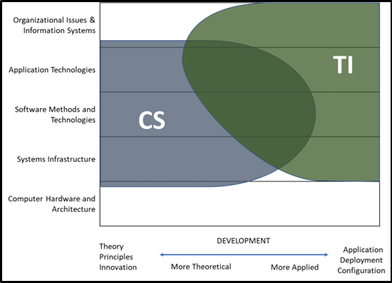
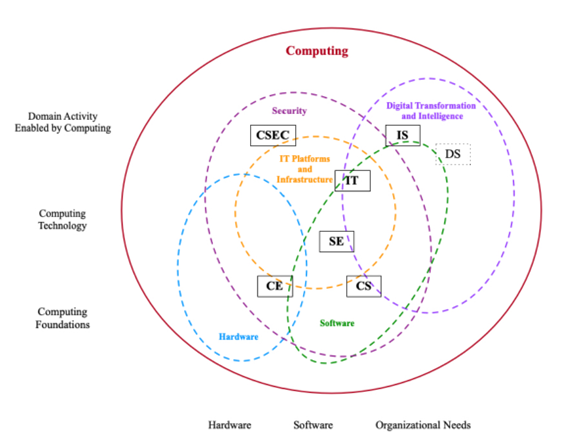
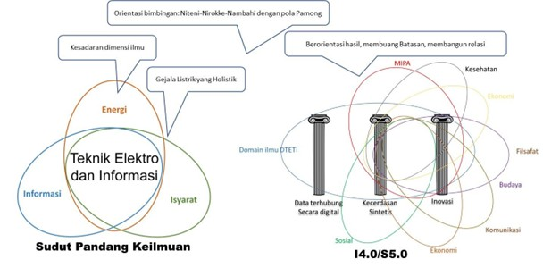

## Penetapan Bahan Kajian

Kurikulum MTI 2022 versi Revisi-2 merupakan pembaruan kurikulum Magister Teknologi Informasi 2017 dengan mempertimbangkan beberapa aspek. Pertama, kesinambungan dengan Program Sarjana Program Studi Teknologi Informasi  (PSPSTIF). Kesinambungan yang dimaksud adalah adanya kesesuaian konsentrasi PMPSTI yang merupakan spesialisasi dari jalur karir (career path) yang ada di PSPSTIF. Terdapat empat konsentrasi PMPSTI, yakni ***Human-centered Software Engineering*** **(HcSE)** yang merupakan spesialisasi dari jalur karir Software engineer bagi keahlian Rekayasa Perangkat Lunak PSPSTIF, ***Data Analytics and Pervasive Intelligence*** yang merupakan spesialisasi dari jalur karir IT Professional dan Information Worker bagi keahlian Rekayasa Sistem Informasi, dan ***Cybersecurity*** yang merupakan spesialisasi dari jalur karir ***Network & Infrastructure Architect*** bagi keahlian Rekayasa Sistem Komputer. Adapun konsentrasi keempat adalah **smart-government** yang merupakan konsentrasi penciri PMPSTI DTETI UGM.

Aspek kedua, Kurikulum MTI 2022 versi Revisi-2 juga berkaca pada Kurikulum PSPSTIF yang telah lebih dahulu diperbarui pada tahun 2021 yang mengacu pada proses akreditasi internasional *Accreditation Board for Engineering and Technology* (ABET) dan *Indonesian Accreditation Board for Engineering* (IABEE) yang disesuaikan dengan kebutuhan program magister. Kedua akreditasi tersebut menyatakan bahwa penguasaan ilmu dasar harus diperkuat pada bidang ilmu teknologi informasi untuk dapat beradaptasi pada perubahan cepat khususnya pada ilmu teknologi informasi dan Industry 4.0. Hal ini diperkuat dengan adanya testimoni lulusan melalui tracer study dan hasil audit AMI yang secara eksplisit mengemukakan bahwa kurikulum 2017 kurang dalam matematika dan statistika.

Aspek yang terakhir yang menjadi bahan pertimbangan pembaruan kurikulum adalah amanat Peraturan Rektor No. 18 Tahun 2019 tentang Penyelenggaraan Program Pascasarjana Berbasis Riset (*by Researc*h) di Lingkungan Universitas Gadjah Mada. 

Dalam menetapkan Kurikulum MTI 2022 versi Revisi-2, tim memperhatikan perpotongan (intersection) dengan program studi lain, khususnya keilmuan program studi Ilmu Komputer yang dianggap sangat dekat dengan keilmuan Teknologi Informasi. Hal ini dilakukan untuk mengetahui tujuan dan diferensiasi  dengan PMPSTI. Mengacu pada *Computing Curricula (The Joint Task Force for Computing Curricula, 2005)*,  perbedaan keilmuan Ilmu Komputer dan Teknologi Informasi digambarkan pada @fig-perbedaan_tujuan_pendidikan .

{#fig-perbedaan_tujuan_pendidikan fig-align="center"}

Ilmu Komputer menekankan pada sebagian besar kebutuhan komputasi yang dilakukan oleh sebuah komputer termasuk di dalamnya teknik pengembangan perangkat lunak, infrastruktur, hingga teknologi aplikasi. Namun demikian, ilmu komputer tidak mendiskusikan bagaimana sebuah solusi komputasi didistribusikan, dikelola, dan juga disesuaikan dengan kebutuhan pengguna. Dengan kata lain, hal tersebutlah yang dipenuhi di Program Studi Teknologi Informasi. Program Magister Program Studi Teknologi Informasi lebih melekat pada penerapan yang tidak melupakan aspek keteknikan yang lebih menekankan bagaimana sebuah solusi TIK dibuat, didistribusikan, dan dikelola oleh manusia.

\
Dilihat dari level komputasi yang dibutuhkan (fondasi/dasar, teknologi, domain aktivitas) dan komponen yang menjadi fokus (domain hardware/software, dan kebutuhan organisasi), keilmuan komputasi terbagi tidak hanya menjadi Ilmu Komputer (CS) dan Teknologi Informasi (IT) saja, tetapi juga terdapat Keamanan Siber (CSEC), Sistem Informasi (SI), Rekayasa Perangkat Lunak (SE), dan data science (DS) seperti yang ditunjukkan pada @fig-tinjauan_keilmuan . CSEC berpotongan dengan Teknologi Informasi dalam hal platform & Infrastruktur TIK dan keamanan. Perpotongan tersebut, bila ditambahkan komponen software, akan membentuk keilmuan SE. Untuk mengakomodir kebutuhan organisasi yang berorientasi pada transformasi digital dan intelegensia, maka Teknologi Informasi akan berpotongan dengan DS. Perpotongan-perpotongan tersebut tidaklah absolut dan setiap keilmuan akan memiliki porsi yang berbeda-beda.

{#fig-tinjauan_keilmuan fig-align="center"}

PMPSTI mengakomodir perpotongan topik-topik spesifik namun masih berkaitan dengan keilmuan Teknologi Informasi. Berdasarkan kajian tersebut, ditetapkan bahan pengajaran untuk membentuk 4 konsentrasi PMPSTI, yakni NC (Network and Cybersecurity), HcSE (Human-centered Software Engineering), SG (Smart Government), dan DAPI (Data analytics and Pervasive Intelligence). Konsentrasi NC akan berfokus pada infrastruktur, jaringan dan domain keamanan. Konsentrasi HcSE berfokus pada perekayasaan perangkat lunak. Konsentrasi SG dan DAPI berfokus pada transformasi digital dan intelegensia untuk memenuhi kebutuhan spesifik yang ada pada organisasi, misalnya mitra lembaga/badan pemerintahan ataupun industri. 

Sedangkan relasi antara keilmuan PMPSTI terhadap ilmu lain dalam kerangka i4.0 dan s5.0 diilustrasikan @fig-relasi_sudut_pandang. Terlihat bahwa keilmuan PMPSTI sebagai bagian dari keilmuan DTETI dapat memiliki interseksi dengan berbagai bidang keilmuan.

{#fig-relasi_sudut_pandang fig-align="center"}