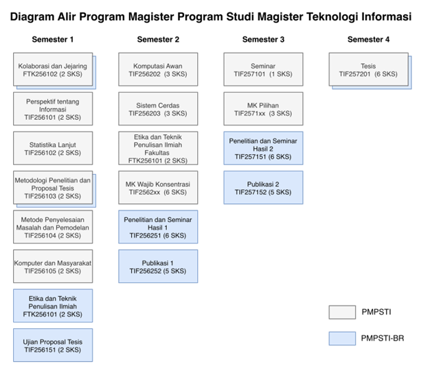

## Penetapan Mata Kuliah

Kurikulum PMPSTI versi Revisi-2 terdiri dari dua skema yaitu skema berbasis perkuliahan dan skema berbasis riset. Skema berbasis perkuliahan merupakan skema yang telah dijalankan selama ini, sedangkan kurikulum berbasis riset merupakan skema baru sesuai dengan Peraturan Rektor UGM No. 18 Tahun 2019.

### Kurikulum berbasis perkuliahan (*by course*)

Kurikulum PMPSTI berbasis perkuliahan dijabarkan dalam bentuk mata kuliah dengan bobot keseluruhan 36 SKS yang terdiri dari MK wajib umum, MK wajib konsentrasi, MK pilihan, seminar, dan Tesis. Pembagian bobot SKS dapat dilihat pada @tbl-course-based.

```{r}
#| label: tbl-course-based
#| tbl-cap: "Struktur Kurikulum PMPSTI Berbasis Perkuliahan"
#| echo: false
#| warning: false
#| message: false

library(knitr)
library(kableExtra)

df2 <- data.frame(
  "Mata Kuliah" = c(
    "MK Wajib Umum",
    "MK Wajib Konsentrasi",
    "MK Pilihan",
    "Seminar",
    "Tesis + Ujian Tesis",
    "Total"
  ),
  "SKS" = c(20, 6, 3, 1, 6, 36),
  check.names = FALSE
)

kbl2 <- kable(
  df2,
  col.names = c("Mata Kuliah", "SKS"),
  booktabs  = TRUE,
  align     = c("l","c"),

) |>
  kable_styling(
    position = "center",
    full_width = FALSE
  ) |>
  row_spec(0, bold = TRUE ) |>
  row_spec(6, bold = TRUE ) |>   
  column_spec(1, width = "350px")

kbl2
```

Struktur mata kuliah pada setiap semester ditunjukkan pada @tbl-course-based-semester dengan total bobot 36 SKS.

```{r}
#| label: tbl-course-based-semester
#| tbl-cap: "Struktur Mata Kuliah PMPSTI untuk Setiap Semester"
#| echo: false
#| warning: false
#| message: false
library(here)
library(knitr)
library(dplyr)
library(kableExtra)

df_raw <- read.csv(here("chapter2/data", "_d_course_semester.csv"),
                   check.names = FALSE,
                   fileEncoding = "UTF-8",
                   colClasses = c(NO      = "character",
                                  KODE_MK = "character",
                                  NAMA_MK = "character",
                                  SIFAT   = "character",
                                  SKS     = "integer",
                                  SEMESTER = "integer"))

jumlah_per_sem <- df_raw %>%
  group_by(SEMESTER) %>%
  summarise(SKS = sum(SKS), .groups = "drop")

df_final    <- data.frame()
sem_start   <- c()
sem_end     <- c()
row_jumlah  <- c()
current_row <- 0

for (sem in sort(unique(df_raw$SEMESTER))) {
  baris_data <- df_raw %>%
    filter(SEMESTER == sem) %>%
    mutate(SKS = as.character(SKS)) %>%
    select(NO, KODE_MK, NAMA_MK, SIFAT, SKS)

  n_data      <- nrow(baris_data)
  sem_start   <- c(sem_start, current_row + 1)
  sem_end     <- c(sem_end,   current_row + n_data)
  current_row <- current_row + n_data

  total_sem    <- jumlah_per_sem$SKS[jumlah_per_sem$SEMESTER == sem]
  baris_jumlah <- data.frame(
    NO = "", KODE_MK = "", NAMA_MK = "",
    SIFAT = "", SKS = as.character(total_sem),
    stringsAsFactors = FALSE
  )
  current_row <- current_row + 1
  row_jumlah  <- c(row_jumlah, current_row)
  df_final <- bind_rows(df_final, baris_data, baris_jumlah)
}

total_all   <- sum(df_raw$SKS)
baris_total <- data.frame(
  NO = "", KODE_MK = "", NAMA_MK = "",
  SIFAT = "", SKS = as.character(total_all),
  stringsAsFactors = FALSE
)
df_final  <- bind_rows(df_final, baris_total)
row_total <- nrow(df_final)

sks_jumlah <- df_final$SKS[row_jumlah]
sks_total  <- df_final$SKS[row_total]

if (knitr::is_latex_output()) {
  for (i in seq_along(row_jumlah)) {
    idx <- row_jumlah[i]
    df_final$NO[idx]      <- ""
    df_final$KODE_MK[idx] <- ""
    df_final$NAMA_MK[idx] <- "Jumlah SKS"
    df_final$SIFAT[idx]   <- ""
    df_final$SKS[idx]     <- sks_jumlah[i]
  }
  df_final$NO[row_total]      <- ""
  df_final$KODE_MK[row_total] <- ""
  df_final$NAMA_MK[row_total] <- "Total SKS"
  df_final$SIFAT[row_total]   <- ""
  df_final$SKS[row_total]     <- sks_total
} else {
  for (i in seq_along(row_jumlah)) {
    idx <- row_jumlah[i]
    df_final$NO[idx]      <- ""
    df_final$KODE_MK[idx] <- ""
    df_final$NAMA_MK[idx] <- paste0("Jumlah SKS: ", sks_jumlah[i])
    df_final$SIFAT[idx]   <- ""
    df_final$SKS[idx]     <- ""
  }
  df_final$NO[row_total]      <- ""
  df_final$KODE_MK[row_total] <- ""
  df_final$NAMA_MK[row_total] <- paste0("Total SKS: ", sks_total)
  df_final$SIFAT[row_total]   <- ""
  df_final$SKS[row_total]     <- ""
}

kbl_tbl <- kbl(
  df_final,
  col.names = c("NO", "KODE MK", "NAMA MK", "SIFAT", "SKS"),
  booktabs  = TRUE,
  escape    = FALSE,
  longtable = FALSE,
    
  align = if (knitr::is_latex_output()) c(
    ">{\\centering\\arraybackslash}p{0.04\\textwidth}",
    ">{\\centering\\arraybackslash}p{0.16\\textwidth}",
    ">{\\raggedright\\arraybackslash}p{0.38\\textwidth}",
    ">{\\raggedright\\arraybackslash}p{0.23\\textwidth}",
    ">{\\centering\\arraybackslash}p{0.06\\textwidth}"
  ) else c("c","c","l","l","c")
) |>
  kable_styling(
    latex_options = c("hold_position", "striped"),
    full_width    = FALSE
  ) |>
  row_spec(0, bold = TRUE)

sem_labels <- sort(unique(df_raw$SEMESTER))
for (i in seq_along(sem_labels)) {
  kbl_tbl <- kbl_tbl |>
    pack_rows(paste("SEMESTER", sem_labels[i]),
              sem_start[i], sem_end[i],
              bold            = TRUE,
              hline_after     = TRUE,
              latex_gap_space = "0.5em",
              colnum          = 5)
}

kbl_tbl |>
  row_spec(row_jumlah, bold = TRUE,
           extra_latex_after = "\\hline") |>
  row_spec(row_total, bold = TRUE)
```

Kurikulum PMPSTI memiliki 4 konsentrasi sebagaimana berdasarkan bahan kajian di atas dan masukan dari advisory board dan pengguna lulusan, yaitu:

a.  Konsentrasi Analisis data dan kecerdasan Tersebar (*Data analytics and Pervasive Intelligence* = DAPI)

b.  Konsentrasi Rekayasa Perangkat Lunak berpusat pada Manusia (*Human-centered Software Engineering* = HcSE)

c.  Konsentrasi Pemerintahan Cerdas (*Smart Government* = SG)

d.  Konsentrasi Keamanan Jaringan (*Network and Cybersecurity* = NC)

Mahasiswa PMPSTI wajib memilih satu dari empat konsentrasi yang ada. Pada semester kedua mahasiswa diwajibkan mengambil 2 mata kuliah wajib konsentrasi dengan total bobot 6 SKS, kemudian pada semester berikutnya mahasiswa akan mengambil 1 mata kuliah pilihan konsentrasi dengan total bobot 3 SKS, sesuai dengan struktur pada @tbl-course-based-semester. Adapun mata kuliah wajib konsentrasi dan pilihan konsentrasi ditunjukkan pada @tbl-compulsory-study dan @tbl-elective-study. PMPSTI menawarkan 6 mata kuliah pilihan untuk masing-masing konsentrasi, bergantung pada konsentrasi yang dipilih mahasiswa. Namun, hanya mata kuliah dengan jumlah minimum 3 peserta yang akan diselenggarakan.

```{r}
#| label: tbl-compulsory-study
#| tbl-cap: "Daftar Mata Kuliah Wajib Konsentrasi PMPSTI"
#| echo: false
#| warning: false
#| message: false

library(here)
library(knitr)
library(readr)
library(dplyr)
library(kableExtra)

df3 <- read.csv(here("chapter2/data", "a_compulsory_study.csv"),
                check.names = FALSE,
                fileEncoding = "UTF-8")

if (knitr::is_html_output()) {

  kable(df3, booktabs = TRUE, align = c("c","c","l","c","l")) |>
    kable_styling(position = "center", full_width = FALSE) |>
    row_spec(0, bold = TRUE ) |>
    column_spec(1, width = "60px")  |>
    column_spec(2, width = "110px") |>
    column_spec(3, width = "420px") |>
    column_spec(4, width = "60px")  |>
    column_spec(5, width = "160px")

} else {
  kbl(df3, booktabs = TRUE,
      escape = FALSE,
      align = c(
        ">{\\centering\\arraybackslash}p{0.04\\textwidth}",
        ">{\\centering\\arraybackslash}p{0.13\\textwidth}",
        ">{\\raggedright\\arraybackslash}p{0.42\\textwidth}",
        ">{\\centering\\arraybackslash}p{0.05\\textwidth}",
        ">{\\raggedright\\arraybackslash}p{0.23\\textwidth}"
      )) |>
    kable_styling(
      latex_options = c("striped", "hold_position"),
    ) |>
    row_spec(0, bold = TRUE)
}
```

```{r}
#| label: tbl-elective-study
#| tbl-cap: "Daftar Mata Kuliah Pilihan PMPSTI"
#| echo: false
#| warning: false
#| message: false

library(here)
library(knitr)
library(readr)
library(dplyr)
library(kableExtra)

df4 <- read.csv(here("chapter2/data", "b_elective_study.csv"),
                check.names = FALSE,
                fileEncoding = "UTF-8")


if (knitr::is_html_output()) {
  kable(df4, booktabs = TRUE, align = c("c","c","l","c","l")) |>
    kable_styling(position = "center", full_width = FALSE) |>
    row_spec(0, bold = TRUE ) |>
    column_spec(1, width = "60px")  |>
    column_spec(2, width = "110px") |>
    column_spec(3, width = "420px") |>
    column_spec(4, width = "60px")  |>
    column_spec(5, width = "160px")

} else {
  kbl(df3, booktabs = TRUE,
      escape = FALSE,
      align = c(
        ">{\\centering\\arraybackslash}p{0.04\\textwidth}",
        ">{\\centering\\arraybackslash}p{0.13\\textwidth}",
        ">{\\raggedright\\arraybackslash}p{0.42\\textwidth}",
        ">{\\centering\\arraybackslash}p{0.05\\textwidth}",
        ">{\\raggedright\\arraybackslash}p{0.23\\textwidth}"
      )) |>
    kable_styling(
      latex_options = c("striped", "hold_position"),
    ) |>
    row_spec(0, bold = TRUE)

}
```

#### Peta Kurikulum

@tbl-curriculum-mapping menampilkan pemetaan dari semua mata kuliah dari kurikulum 2022 Versi Revisi - 2 ke CPL.

```{=latex}
\begin{landscape}
```

```{r}
#| echo: false
#| warning: false
#| message: false
#| label: tbl-curriculum-mapping
#| tbl-cap: "Pemetaan Mata Kuliah Berbasis Perkuliahan Terhadap CPL"

library(kableExtra)

chk <- if (knitr::is_latex_output()) "$\\checkmark$" else "✓"
mt  <- ""

df_mk <- data.frame(
  Sem   = c(1,1,1,1,1,1, 2,2,2,2,2,2,2,2,2,2,2, 3,3,3,3,3,3,3,3,3,3,3,3,3,3,3,3,3,3,3,3,3,3,3,3,3, 4),
  Kode  = c(
    "FTK256102","TIF 256101","TIF 256102","TIF 256103","TIF 256104","TIF 256105",
    "FTK256101","TIF 256202","TIF 256203","TIF 256211","TIF 256212","TIF 256221","TIF 256222","TIF 256231","TIF 256232","TIF 256241","TIF 256242",
    "TIF 257101","TIF 257111","TIF 257112","TIF 257113","TIF 257114","TIF 257115","TIF 257116","TIF 257121","TIF 257122","TIF 257123","TIF 257124","TIF 257125","TIF 257126","TIF 257131","TIF 257132","TIF 257133","TIF 257134","TIF 257135","TIF 257136","TIF 257141","TIF 257142","TIF 257143","TIF 257144","TIF 257145","TIF 257146",
    "TIF 257201"
  ),
  `Nama MK` = c(
    "Kolaborasi dan Jejaring",
    "Perspektif Informasi",
    "Statistika Lanjut",
    "Metodologi, Etika Penelitian dan Proposal Tesis",
    "Metode Penyelesaian Masalah dan Pemodelan",
    "Komputer dan Masyarakat",
    "Etika dan Teknik Penulisan Ilmiah",
    "Komputasi Awan",
    "Sistem Cerdas",
    "Gudang dan Penambangan Data",
    "Komputasi Tersebar",
    "Rekayasa Kebutuhan",
    "Arsitektur dan Perancangan Perangkat Lunak",
    "Pengolahan Data Untuk Pemerintahan",
    "Pemerintahan Elektronis",
    "Keamanan Teknologi Informasi",
    "Jaringan Komputer Lanjut",
    "Seminar",
    "Interoperabilitas Lanjut",
    "Jaringan Nirkabel dan Bergerak",
    "Visi Komputer",
    "Operasi Riset",
    "Kecerdasan Bisnis",
    "Pengembangan Aplikasi Peranti Bergerak Lanjut",
    "Interaksi Manusia Dan Komputer Lanjut",
    "Antar Muka Alamia",
    "Rekayasa Faktor Manusia Dan Ergonomi",
    "Pengujian dan Implementasi Perangkat Lunak",
    "System and Software Modelling",
    "Aplikasi Kontemporer",
    "Perencanaan Strategis Teknologi Informasi",
    "Manajemen Proyek Teknologi Informasi",
    "Audit Teknologi Informasi",
    "Kepemimpinan TIK",
    "Teknologi Kota Cerdas",
    "Manajemen Perubahan dan Risiko TI",
    "Keamanan dan Integritas Data Lanjut",
    "Keamanan Jaringan Komputer",
    "Keamanan Peranti Bergerak dan IoT",
    "Keamanan Komputasi Awan",
    "Kriptografi",
    "Teknologi Blockchain",
    "Tesis"
  ),
  SKS = c(2,2,2,2,2,2, 2,3,3,3,3,3,3,3,3,3,3, 1,3,3,3,3,3,3,3,3,3,3,3,3,3,3,3,3,3,3,3,3,3,3,3,3, 6),
  CPL1 = c(chk,chk,chk,chk,mt,chk, chk,chk,chk,mt,chk,mt,mt,chk,mt,chk,mt, mt,mt,chk,chk,chk,mt,mt,chk,chk,chk,mt,mt,mt,chk,mt,chk,chk,mt,mt,chk,chk,mt,mt,chk,chk, mt),
  CPL2 = c(chk,mt,mt,mt,chk,mt, chk,chk,chk,chk,chk,mt,chk,mt,mt,mt,chk, mt,mt,mt,chk,mt,chk,mt,chk,chk,chk,mt,chk,chk,mt,mt,mt,mt,chk,mt,mt,mt,chk,chk,mt,chk, chk),
  CPL3 = c(mt,mt,chk,mt,chk,mt, mt,mt,chk,mt,chk,chk,mt,chk,mt,mt,mt, mt,chk,mt,chk,chk,chk,mt,mt,mt,chk,mt,mt,mt,mt,mt,mt,mt,mt,mt,mt,mt,mt,mt,mt,mt, chk),
  CPL4 = c(mt,mt,chk,mt,mt,chk, mt,chk,chk,mt,mt,chk,chk,chk,chk,chk,chk, mt,chk,mt,mt,mt,chk,chk,chk,chk,mt,chk,chk,chk,mt,mt,chk,chk,chk,mt,chk,chk,chk,chk,chk,mt, chk),
  CPL5 = c(mt,mt,mt,chk,mt,mt, chk,mt,mt,mt,mt,mt,chk,mt,mt,mt,mt, mt,mt,mt,mt,mt,mt,mt,mt,mt,mt,chk,mt,mt,mt,mt,mt,mt,mt,mt,mt,mt,mt,mt,mt,mt, chk),
  CPL6 = c(mt,mt,mt,mt,mt,chk, mt,chk,mt,mt,chk,mt,mt,mt,chk,mt,mt, mt,mt,mt,mt,mt,mt,chk,mt,mt,mt,mt,chk,chk,chk,mt,chk,chk,chk,mt,mt,mt,chk,mt,mt,mt, mt),
  CPL7 = c(chk,mt,mt,mt,mt,mt, mt,mt,mt,mt,mt,chk,chk,mt,mt,mt,mt, chk,chk,mt,mt,mt,mt,mt,mt,mt,mt,mt,mt,mt,mt,chk,mt,mt,mt,chk,mt,mt,mt,mt,mt,mt, mt),
  CPL8 = c(mt,chk,mt,mt,mt,chk, mt,mt,mt,mt,mt,mt,chk,mt,chk,chk,mt, chk,mt,mt,mt,mt,mt,chk,mt,mt,mt,mt,chk,chk,chk,chk,mt,chk,mt,mt,mt,mt,mt,mt,mt,mt, chk),
  CPL9 = c(mt,mt,mt,mt,mt,mt, mt,mt,mt,mt,mt,mt,mt,mt,mt,chk,mt, chk,mt,mt,mt,mt,mt,mt,mt,mt,mt,mt,mt,mt,chk,chk,mt,chk,mt,chk,mt,mt,mt,chk,chk,mt, mt),
  check.names = FALSE
)

is_pdf <- knitr::is_latex_output()

if (is_pdf) {
  kbl(df_mk,
      booktabs  = TRUE,
      escape    = FALSE,
      longtable = TRUE,
      align     = c(
        ">{\\centering\\arraybackslash}p{0.8cm}",   # Sem
        "p{2.2cm}",                                  # Kode
        "p{5.0cm}",                                  # Nama MK
        ">{\\centering\\arraybackslash}p{0.8cm}",   # SKS
        ">{\\centering\\arraybackslash}p{0.7cm}",   # CPL1
        ">{\\centering\\arraybackslash}p{0.7cm}",   # CPL2
        ">{\\centering\\arraybackslash}p{0.7cm}",   # CPL3
        ">{\\centering\\arraybackslash}p{0.7cm}",   # CPL4
        ">{\\centering\\arraybackslash}p{0.7cm}",   # CPL5
        ">{\\centering\\arraybackslash}p{0.7cm}",   # CPL6
        ">{\\centering\\arraybackslash}p{0.7cm}",   # CPL7
        ">{\\centering\\arraybackslash}p{0.7cm}",   # CPL8
        ">{\\centering\\arraybackslash}p{0.7cm}"    # CPL9
      ),
      col.names = c("Sem","Kode","Nama MK","SKS",
                    "1","2","3","4","5","6","7","8","9")
  ) %>%
    kable_styling(
      latex_options = c("striped", "repeat_header"),
      stripe_color  = "#F5F5F5"
    ) %>%
    row_spec(0, bold = TRUE ) %>%
    add_header_above(c(" " = 4, "Capaian Pembelajaran Lulusan (CPL)" = 9),
                     bold = TRUE , escape = FALSE)

} else {
  kbl(df_mk,
      booktabs  = TRUE,
      escape    = FALSE,
      align     = c("c","l","l","c","c","c","c","c","c","c","c","c","c"),
      col.names = c("Sem","Kode","Nama MK","SKS",
                    "1","2","3","4","5","6","7","8","9")
  ) %>%
    kable_styling(
      full_width        = FALSE,
      bootstrap_options = c("striped","bordered","condensed","hover"),
      stripe_color      = "#F5F5F5"
    ) %>%
    row_spec(0, bold = TRUE) %>%
    add_header_above(c(" " = 4, "Capaian Pembelajaran Lulusan (CPL)" = 9),
                     bold = TRUE, escape = FALSE)
}
```

```{=latex}
\end{landscape}
```

***Mekanisme Pelaksanaan Tesis:***

Tesis (6 SKS) dilaksanakan pada semester 4, yaitu sesudah mahasiswa dinyatakan lolos pada penilaian Publikasi dengan keterangan sebagai berikut.

a.  Mahasiswa diwajibkan menyusun Naskah Tesis sebagai laporan penelitian Tesis sebagai syarat untuk pelaksanaan Ujian Tesis. Naskah Tesis harus disetujui dan ditandatangani oleh semua dosen pembimbing.

b.  Ujian Pra Tesis (1 SKS) dilakukan pada semester 4. Berikut adalah rincian pelaksanaannya:

    -   Naskah Tesis yang sudah disetujui tim pembimbing harus diserahkan ke bagian akademik.

    -   Ujian Pra Tesis dilaksanakan secara lisan di hadapan dewan penguji.

    -   Dewan penguji terdiri atas dosen-dosen Program Magister Program Studi Teknologi Informasi yang sesuai bidangnya.

    -   Dewan Penguji memberi nilai pada sidang Ujian Pra Tesis. Jika nilai kurang dari B, maka mahasiswa wajib mengulang Ujian Pra Tesis.

c.  Ujian Tesis yang memiliki bobot 4 SKS dijadwalkan untuk dilaksanakan pada semester keempat. Berikut merupakan rincian pelaksanaannya secara lebih mendetail:

    -   Naskah Tesis yang sudah direvisi berdasarkan masukan-masukan pada ujian pra Tesis dan sudah disetujui oleh tim pembimbing harus diserahkan ke bagian akademik.

    -   Ujian Tesis dilaksanakan secara lisan di hadapan dewan penguji.

    -   Dewan penguji terdiri atas dosen-dosen Program Magister Program Studi Teknologi Informasi dan/atau penguji dari luar Prodi yang sesuai bidangnya.

    -   Dewan Penguji memberi nilai pada sidang Ujian Tesis bedasarkan Naskah dan ujian lisan. Jika nilai kurang dari B, maka mahasiswa wajib mengulang Ujian Tesis.

d.  Naskah Tesis hasil revisi berdasarkan masukan dewan penguji Tesis akan dinilai oleh Dosen Pembimbing Tesis dengan bobot 1 SKS.

### Kurikulum berbasis riset (By Research)

Kurikulum PMPSTI-BR dijabarkan dalam bentuk mata kuliah dengan bobot keseluruhan 36 SKS. Pembagian bobot SKS dapat dilihat pada @tbl-course-research. Sedangkan pemetaan mata kuliah PMPSTI-BR terhadap CPL untuk setiap semesternya terdapat pada @tbl-research-mapping. Komposisi kegiatan perkuliahan dan penelitian didasarkan pada Peraturan Rektor UGM No. 18 Tahun 2019 tentang Penyelenggaraan Program Pascasarjana Berbasis Riset.

```{r}
#| label: tbl-course-research
#| tbl-cap: "Struktur Kurikulum PMPSTI Berbasis Penelitian"
#| echo: false
#| warning: false
#| message: false

library(knitr)
library(kableExtra)

df <- data.frame(
  "Mata Kuliah" = c(
    "MATA KULIAH WAJIB",
    "Metodologi, Etika Penelitian dan Proposal Tesis",
    "Kolaborasi dan Jejaring (Collaboration and Networking)",
    "Etika dan Teknik Penulisan Ilmiah",
    "Sub total",
    "",
    "MATA KULIAH PENELITIAN",
    "Ujian Proposal Tesis",
    "Penelitian dan Seminar Hasil 1 (DAPI, HcSE, SG, NC)",
    "Publikasi 1",
    "Penelitian dan Seminar Hasil 2 (DAPI, HcSE, SG, NC)",
    "Publikasi 2",
    "Tesis MBR",
    "Sub total"
  ),
  "SKS" = c(
    "", 2, 2, 2, 6,
    "",
    "", 2, 6, 5, 6, 5, 6, 30
  ),
  "Kegiatan" = c(
    "",
    "Perkuliahan",
    "Perkuliahan",
    "Perkuliahan",
    "",
    "",
    "",
    "Penelitian",
    "Penelitian",
    "Penelitian",
    "Penelitian",
    "Penelitian",
    "Penelitian",
    ""
  ),
  check.names = FALSE
)

kbl <- kable(
  df,
  booktabs = TRUE,
  align = c("l", "c", "c")
)

# =========================
# Styling HTML
# =========================
if (knitr::is_html_output()) {
  
  kbl <- kbl |>
    kable_styling(
      position = "center",
      full_width = FALSE,
      bootstrap_options = c("striped", "hover", "condensed")
    ) |>
    row_spec(1, bold = TRUE ) |>
    row_spec(5, bold = TRUE, background = "#E6F2F3") |>
    row_spec(7, bold = TRUE ) |>
    row_spec(14, bold = TRUE, background = "#E6F2F3")
}

# =========================
# Styling PDF / LaTeX
# =========================
if (knitr::is_latex_output()) {
  
  kbl <- kbl |>
    kable_styling(
      position = "center",
      full_width = FALSE,
      latex_options = c("hold_position", "striped", "scale_down")
    ) |>
    row_spec(1, bold = TRUE) |>
    row_spec(5, bold = TRUE) |>
    row_spec(7, bold = TRUE) |>
    row_spec(14, bold = TRUE)
}

kbl
```

```{=latex}
\begin{landscape}
```

```{r}
#| echo: false
#| warning: false
#| message: false
#| label: tbl-research-mapping
#| tbl-cap: "Pemetaan Mata Kuliah Berbasis Penelitian Terhadap CPL"

library(kableExtra)

chk <- if (knitr::is_latex_output()) "$\\checkmark$" else "✓"
mt  <- ""

df_mk <- data.frame(
  Sem  = c(1,1,1,1,2,2,3,3,4),
  SKS  = c(2,2,2,2,6,5,6,5,6),
  Kode = c("FTK256102","FTK256101","TIF256103","TIF256151",
           "TIF256251","TIF256252",
           "TIF257151","TIF257152",
           "TIF257201"),
  `Mata Kuliah` = c(
    "Kolaborasi dan Jejaring",
    "Etika dan Teknik Penulisan Ilmiah",
    "Metodologi, Etika Penelitian dan Proposal Tesis",
    "Ujian Proposal Tesis",
    "Penelitian dan Seminar Hasil 1 (DAPI, HcSE, SG, NC)",
    "Publikasi 1",
    "Penelitian dan Seminar Hasil 2 (DAPI, HcSE, SG, NC)",
    "Publikasi 2",
    "Tesis"
  ),
  CPL1 = c(chk,chk,chk,chk,mt,mt,mt,mt,mt),
  CPL2 = c(chk,chk,mt,mt,mt,mt,mt,mt,chk),
  CPL3 = c(mt,mt,mt,mt,chk,mt,chk,mt,chk),
  CPL4 = c(mt,mt,mt,mt,mt,chk,mt,chk,chk),
  CPL5 = c(chk,chk,chk,chk,chk,chk,chk,chk,mt),
  CPL6 = c(mt,mt,mt,chk,chk,chk,chk,chk,mt),
  CPL7 = c(mt,mt,chk,mt,mt,mt,mt,mt,mt),
  CPL8 = c(mt,mt,mt,mt,mt,mt,mt,mt,chk),
  CPL9 = c(mt,mt,mt,mt,chk,chk,chk,chk,mt),
  check.names = FALSE
)

is_pdf <- knitr::is_latex_output()

if (is_pdf) {

  kbl(df_mk,
      booktabs  = TRUE,
      escape    = FALSE,
      longtable = TRUE,
      align     = c(
        ">{\\centering\\arraybackslash}p{0.8cm}",  # Sem
        ">{\\centering\\arraybackslash}p{0.8cm}",  # SKS
        "p{2.2cm}",                                # Kode
        "p{5.0cm}",                                # Nama MK
        ">{\\centering\\arraybackslash}p{0.7cm}",
        ">{\\centering\\arraybackslash}p{0.7cm}",
        ">{\\centering\\arraybackslash}p{0.7cm}",
        ">{\\centering\\arraybackslash}p{0.7cm}",
        ">{\\centering\\arraybackslash}p{0.7cm}",
        ">{\\centering\\arraybackslash}p{0.7cm}",
        ">{\\centering\\arraybackslash}p{0.7cm}",
        ">{\\centering\\arraybackslash}p{0.7cm}",
        ">{\\centering\\arraybackslash}p{0.7cm}"
      ),
      col.names = c("Sem","SKS","Kode","Mata Kuliah",
                    "1","2","3","4","5","6","7","8","9")
  ) %>%
    kable_styling(
      latex_options = c("striped", "repeat_header"),
      stripe_color  = "#F5F5F5"
    ) %>%
    row_spec(0, bold = TRUE ) %>%
    add_header_above(c(" " = 4, "Capaian Pembelajaran Lulusan (CPL)" = 9),
                     bold = TRUE , escape = FALSE)

} else {

  kbl(df_mk,
      booktabs  = TRUE,
      escape    = FALSE,
      align     = c("c","c","l","l",
                    "c","c","c","c","c","c","c","c","c"),
      col.names = c("Sem","SKS","Kode","Mata Kuliah",
                    "1","2","3","4","5","6","7","8","9")
  ) %>%
    kable_styling(
      full_width        = FALSE,
      bootstrap_options = c("striped","bordered","condensed","hover"),
      stripe_color      = "#F5F5F5"
    ) %>%
    row_spec(0, bold = TRUE) %>%
    add_header_above(c(" " = 4, "Capaian Pembelajaran Lulusan (CPL)" = 9),
                     bold = TRUE, escape = FALSE)
}
```

```{=latex}
\end{landscape}
```

Perkuliahan untuk PMPSTI-BR dilakukan pada semester 1. Sebagaimana mata kuliah pada kurikulum 2022 PMPSTI berbasis perkuliahan, mata kuliah pada PMPSTI-BR terdiri atas Mata kuliah kuliah wajib umum (6 SKS) yaitu Kolaborasi dan jejaring (2 SKS), Etika dan Teknik Penulisan Ilmiah (2 SKS), dan Metodologi,  Etika Penelitian dan Proposal Tesis (2 SKS). Mata kuliah ini sama dengan apa yang ada di skema berbasis perkuliahan.

Selanjutnya, mahasiswa mengambil SKS kegiatan penelitian sebanyak 30 SKS, yang terdiri dari Ujian Proposal Tesis, Penelitian dan Seminar Hasil 1, Publikasi 1, Penelitian dan Seminar Hasil 2, Publikasi 2, dan Tesis.

Penelitian Tesis adalah kegiatan penelitian yang dilakukan mahasiswa selama menempuh studi. Penelitian Tesis meliputi kegiatan-kegiatan yang dijabarkan dari semester 1 sampai dengan semester 4 dengan keterangan sebagai berikut.

1.  Ujian Proposal Tesis (2 SKS) dilakukan pada semester 1. Berikut adalah rincian pelaksanaannya.

    a.  Mahasiswa harus menyusun sebuah Proposal Penelitian Tesis sebagai syarat untuk pelaksanaan Ujian Proposal Tesis.

    b.  Selama menyusun dokumen proposal penelitian Tesis, mahasiswa disarankan menghubungi dosen yang sesuai dengan bidang yang diminati. Dokumen Proposal Tesis harus diserahkan ke bagian akademik pada akhir semester sebagai syarat melaksanakan Ujian Proposal Tesis.

    c.  Ujian Proposal Tesis dilakukan secara lisan di hadapan dewan penguji.

    d.  Dewan penguji terdiri atas dosen-dosen Program Magister Program Studi Teknologi Informasi yang sesuai di bidangnya.

    e.  Dewan Penguji memberi nilai pada sidang Ujian Proposal Tesis. Jika nilai kurang dari B, maka mahasiswa wajib mengulang.

    f.  Jika lulus Ujian Proposal Tesis, mahasiswa dapat melakukan kegiatan penelitiannya sesuai dengan topik yang disepakati, dosen pembimbing kemudian ditetapkan.

2.  Penelitian dan Seminar Hasil 1 (6 SKS) dan Publikasi 1 (5 SKS) dilaksanakan pada semester 2. Kegiatan Penelitian dan Seminar Hasil 1 ini meliputi melakukan penelitian itu sendiri, dan menyusun dokumen Hasil Penelitian Tesis. Pada akhir semester, diselenggarakan Seminar Hasil 1, dengan rincian sebagai berikut.

    a.  Mahasiswa harus menyusun sebuah dokumen Hasil Penelitian Tesis yang pertama dengan arahan dosen pembimbing, sebagai syarat untuk pelaksanaan Seminar Hasil 1.

    b.  Dokumen Hasil Penelitian harus diserahkan ke bagian akademik pada akhir semester sebagai syarat melaksanakan Seminar Hasil 1.

    c.  Ujian seminar hasil 1 dilakukan secara lisan di hadapan dewan penguji.

    d.  Dewan penguji terdiri atas dosen pembimbing dan dosen-dosen Program Magister Program Studi Teknologi Informasi yang sesuai bidangnya.

    e.  Dewan Penguji memberi nilai Seminar Hasil 1. Jika nilai keseluruhan kurang dari B, maka mahasiswa wajib mengulang pelaksanaan Seminar Hasil 1.

Sedangkan, untuk Publikasi 1 (5 SKS) mahasiswa diwajibkan melakukan publikasi selama melakukan penelitian Tesis sesuai dengan Peraturan Rektor No. 18 Tahun 2019 dan Peraturan Rektor No. 23 Tahun 2024. Dalam hal ini, publikasi mahasiswa adalah sebagai syarat untuk menempuh Ujian Tesis.

3.  Penilaian Publikasi merupakan penilaian terhadap hasil publikasi mahasiswa.

    a.  Publikasi mahasiswa dinyatakan sah jika naskah publikasi adalah hasil (sebagian atau keseluruhan) penelitian Tesis, dan ditulis dengan penulis mahasiswa tersebut dan semua dosen pembimbingnya. Mahasiswa tidak harus sebagai penulis pertama, dan harus mencantumkan dosen-dosen pembimbing sesuai dengan Rektor No. 23 Tahun 2024 Pasal 44. Pihak-pihak yang terlibat dalam penelitian itu dapat ditambahkan sebagai penulis selanjutnya.

    b.  Hasil publikasi mahasiswa dibuktikan dengan adanya *prosiding* yang telah dipresentasikan atau jurnal dengan naskah publikasi yang minimal telah mendapatkan *Letter of Acceptance* dari publisher terhadap naskah publikasi tersebut.

    c.  Penilaian Publikasi merupakan penilaian terhadap publikasi yang telah dihasilkan oleh. Pengecekan dilakukan untuk memastikan kredibilitas *publisher* dan bobot *novelty* dan/atau kontribusi paper.

    d.  Penilaian Publikasi dilakukan oleh institusi Program Studi berdasarkan rubrik penilaian.

    e.  Tim Penilaian Publikasi yang ditunjuk oleh Ketua Program Magister Program Studi Teknologi Informasi selanjutnya melakukan penilaian. Jika nilai keseluruhan kurang dari B, maka mahasiswa wajib melakukan publikasi lagi.

    f.  Bobot 5 SKS diberikan dengan pertimbangan penulisan paper untuk seminar internasional rata-rata membutuhkan waktu satu semester. Penulisan paper dilakukan oleh mahasiswa bersamaan ketika melakukan penelitian, yaitu semester 2 dan semester 3, dengan setiap satu semester diharapkan mampu menghasilkan satu paper seminar internasional. Paper untuk jurnal international lebih berat lagi, kira-kira butuh 2 semester untuk menghasilkan sebuah paper jurnal internasional. Penulisan paper ini membutuhkan telaah yang mendalam mengenai *literature review* yang harus dibaca, dasar teori, metodologi, pengolahan data, sampai membuat kesimpulan. Dengan tingkat kedalaman seperti itu, maka hal ini dianggap setara dengan kuliah 5 SKS. Penilaian publikasi terhadap paper tersebut dilakukan pada akhir semester 2.

4.  Penelitian dan Seminar Hasil 2 (6 SKS) dan Publikasi 2 (5 SKS) dilaksanakan pada semester 3. Rincian dan pelaksanaan Penelitian dan Seminar Hasil 2 serta Publikasi 2 sama dengan Penelitian dan Seminar Hasil 1 serta Publikasi 1. Kegiatan ini merupakan kelanjutan dari kegiatan yang sama pada semester sebelumnya.

5.  Tesis (6 SKS) dilaksanakan pada semester 4, yaitu sesudah mahasiswa dinyatakan lolos pada penilaian Publikasi dengan keterangan sebagai berikut.

    a.  Mahasiswa diwajibkan menyusun Naskah Tesis sebagai laporan penelitian Tesis sebagai syarat untuk pelaksanaan Ujian Tesis. Naskah Tesis harus disetujui dan ditandatangani oleh semua dosen pembimbing.

    b.  Ujian Pra Tesis (1 SKS) dilakukan pada semester 4. Berikut adalah rincian pelaksanaannya:

        -   Naskah Tesis yang sudah disetujui tim pembimbing harus diserahkan ke bagian akademik.

        -   Ujian Pra Tesis dilaksanakan secara lisan di hadapan dewan penguji.

        -   Dewan penguji terdiri atas dosen-dosen Program Magister Program Studi Teknologi Informasi yang sesuai bidangnya.

        -   Dewan Penguji memberi nilai pada sidang Ujian Pra Tesis. Jika nilai kurang dari B, maka mahasiswa wajib mengulang Ujian Pra Tesis.

    c.  Ujian Tesis yang memiliki bobot 4 SKS dijadwalkan untuk dilaksanakan pada semester keempat. Berikut merupakan rincian pelaksanaannya secara lebih mendetail:

        -   Naskah Tesis yang sudah direvisi berdasarkan masukan-masukan pada ujian pra Tesis dan sudah disetujui oleh tim pembimbing harus diserahkan ke bagian akademik.

        -   Ujian Tesis dilaksanakan secara lisan di hadapan dewan penguji.

        -   Dewan penguji terdiri atas dosen-dosen Program Magister Program Studi Teknologi Informasi dan/atau  penguji dari luar Prodi yang sesuai bidangnya.

        -   Dewan Penguji memberi nilai pada sidang Ujian Tesis bedasarkan Naskah dan ujian lisan. Jika nilai kurang dari B, maka mahasiswa wajib mengulang Ujian Tesis.

    d.  Naskah Tesis hasil revisi berdasarkan masukan dewan penguji Tesis akan dinilai oleh Dosen Pembimbing Tesis dengan bobot 1 SKS.

6.  Sistem penilaian untuk semua kegiatan penelitian yaitu proposal penelitian, penelitian dan seminar hasil 1, penelitian dan seminar hasil 2, publikasi 1, publikasi 2, dan Tesis menggunakan rubrik penilaian yang terdapat pada sistem informasi akademik PMPSTI.

### Persamaan Dan Perbedaan dengan Magister Teknologi Informasi berbasis Perkuliahan

Persamaan dan perbedaan antara Program Magister Program Studi Teknologi Informasi Berbasis Penelitian (PMPSTI-BR) dengan Program Magister Program Studi Teknologi Informasi (PMPSTI) dinyatakan dalam @tbl-curricula-comparing. PMPSTI adalah Magister Teknologi Informasi yang berbasis kuliah (*master by course*) dan diakhiri dengan Tesis seperti yang selama ini berjalan. Sementara itu, pada PMPSTI-BR ada beberapa mata kuliah baru berbasis penelitian (30 SKS) sebagian di antaranya tidak ada di PMPSTI, antara lain Penelitian dan Seminar Hasil 1 (6 SKS), , Publikasi 1 (5 SKS), Penelitian dan Seminar Hasil 2 (6 SKS), dan Publikasi 2 (5 SKS). Dengan adanya beberapa kuliah baru tersebut, maka PMPSTI-BR berkomitmen untuk merumuskan capaian pembelajaran (CPL) untuk masing-masing kuliah tersebut sesuai yang dipetakan pada @tbl-research-mapping. Informasi lebih lengkap terkait dengan perkuliahan baru ini dapat dilihat pada Lampiran Silabus Mata Kuliah.

```{r}
#| echo: false
#| warning: false
#| message: false
#| label: tbl-curricula-comparing
#| tbl-cap: "Struktur Kurikulum PMPSTI vs PMPSTI-BR"

library(kableExtra)

is_pdf <- knitr::is_latex_output()

if (is_pdf) {
  br <- "\\newline "
} else {
  br <- " "
}

df_cmp <- data.frame(
  No = 1:6,
  Subyek = c(
    "Jumlah SKS",
    "SKS Kuliah",
    "SKS Penelitian",
    "Beban SKS per Semester (1,2,3,4)",
    "Syarat Publikasi",
    "Syarat IPK"
  ),
  PMPSTI = c(
    "36",
    "29",
    "7",
    "12, 14, 4, 6",
    paste0(
      "1 (satu) paper dalam seminar berskala internasional bereputasi; atau", br,
      "1 (satu) paper jurnal nasional bereputasi; atau", br,
      "Tugas akhir lainnya sesuai ketentuan Program Studi"
    ),
    "3,00"
  ),
  `PMPSTI-BR` = c(
    "36",
    "6",
    "30",
    "8, 11, 11, 6",
    paste0(
      "1 (satu) publikasi ilmiah yang diterima (accepted) dalam jurnal ilmiah", br,
      "internasional bereputasi; atau", br,
      "2 (dua) publikasi ilmiah yang diterima dalam prosiding seminar/", br,
      "konferensi internasional bereputasi."
    ),
    "3,25"
  ),
  check.names = FALSE
)

if (is_pdf) {
  kbl(df_cmp,
      booktabs  = TRUE,
      escape    = FALSE,
      align = c(
        ">{\\centering\\arraybackslash}p{0.05\\textwidth}",
        ">{\\raggedright\\arraybackslash}p{0.17\\textwidth}",
        ">{\\raggedright\\arraybackslash}p{0.34\\textwidth}",
        ">{\\raggedright\\arraybackslash}p{0.34\\textwidth}"
      )
  ) %>%
    kable_styling(
      latex_options = c("striped"),
      stripe_color  = "#F5F5F5"
    ) %>%
    row_spec(0, bold = TRUE)
} else {
  kbl(df_cmp,
      booktabs = TRUE,
      escape   = FALSE,
      align    = c("c","l","l","l")
  ) %>%
    kable_styling(
      full_width        = TRUE,
      bootstrap_options = c("striped","bordered","hover"),
      stripe_color      = "#F5F5F5"
    ) %>%
    row_spec(0, bold = TRUE)
}
```

Kedua skema, PMPSTI dan PMPSTI-BR, memiliki susunan mata kuliah tiap semester seperti yang ditampilkan pada diagram di bawah ini.

{fig-align="center"}